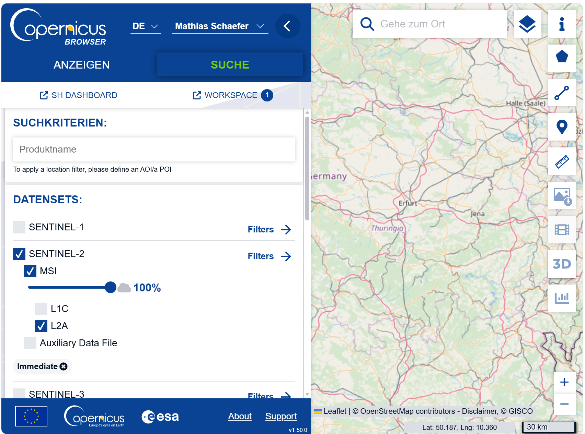
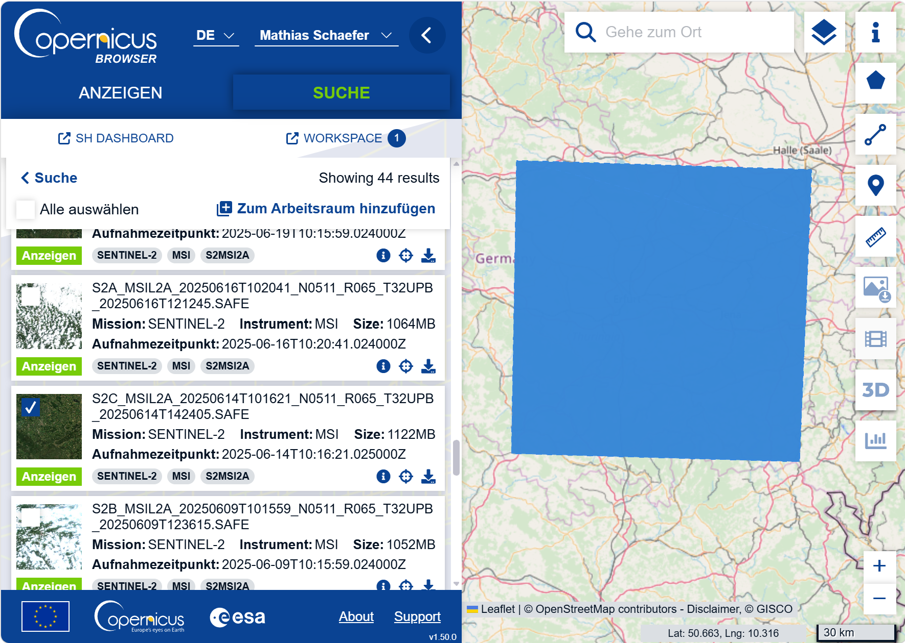

## Copernicus-Konto erstellen

Für den Copernicus Browser wird aktuell ein kostenloses Konto benötigt.

1. Öffnen Sie <https://dataspace.copernicus.eu/>.
2. Klicken Sie oben rechts auf das Avatar- oder Login-Symbol.
3. Klicken Sie auf **REGISTER**.
4. Füllen Sie alle Pflichtfelder aus. Nutzen Sie möglichst Ihre
   Hochschul-E-Mail-Adresse.
5. Akzeptieren Sie die Nutzungsbedingungen und die Datenschutzerklärung.
6. Schließen Sie die Registrierung mit **REGISTER** ab.
7. Öffnen Sie die Bestätigungs-E-Mail und klicken Sie auf den
   Verifizierungslink.
8. Melden Sie sich danach im Copernicus Browser mit E-Mail-Adresse und Passwort
   an.

## Sentinel-2-Daten beschaffen

::: {.callout-note title="Info"}
Der Copernicus Browser eignet sich zum Erkunden der Szenen. SCP ist praktisch,
wenn die Daten direkt in QGIS weiterverarbeitet werden sollen. Für den Kurs
genügt einer der beiden Wege, solange die ausgewählte Szene später im
Projektordner wiedergefunden wird.
:::

::: {.panel-tabset}

### Copernicus Browser

1. Öffnen Sie den [Copernicus Browser](https://dataspace.copernicus.eu/browser/).
2. Melden Sie sich mit Ihrem Copernicus-Konto an.
3. Suchen Sie rechts oben nach `Gösselsdorf` oder zoomen Sie zur Saalfelder Höhe.
4. Wählen Sie links im Tab **Search** die **Data collection** **Sentinel-2**.
5. Wählen Sie als **Processing level** **L2A**, da diese Daten bereits
   atmosphärisch korrigiert sind.
6. Lassen Sie den Wolkenanteil bei `100 %`.

{#fig-copernicus-suche fig-alt="Suchmaske des Copernicus Browser mit ausgewähltem Datensatz Sentinel-2 L2A und geöffneten Suchkriterien über Thüringen." width="100%"}

::: {.callout-note .checkpoint-callout title="Checkpoint"}
Ist ein hoher Wolkenanteil im gesamten Sentinel-2-Produkt automatisch ein
Ausschlusskriterium?
:::

7. Stellen Sie den Zeitraum `2025-06-01` bis `2025-06-30` ein.
8. Öffnen Sie geeignete Treffer in der Vorschau und prüfen Sie, ob der
   Untersuchungsraum wolkenfrei sichtbar ist.
9. Klicken Sie den gewünschten Treffer in der Ergebnisliste an. Die
    zugehörige Kachel wird als blaue Fläche auf der Karte hervorgehoben.
10. Klicken Sie beim Treffer rechts unten auf das **Download-Symbol** mit dem
    nach unten gerichteten Pfeil.

{#fig-copernicus-download fig-alt="Ergebnisliste im Copernicus Browser mit ausgewählter Sentinel-2-L2A-Szene, blau hervorgehobener Kachel und Download-Symbol am rechten Rand des Treffers." width="100%"}

11. Warten Sie, bis der Fortschrittsbalken unter dem Produkt vollständig
    durchgelaufen ist. Lassen Sie den Browser währenddessen geöffnet.
12. Speichern Sie das heruntergeladene vollständige Produkt als
    ZIP-Datei ab.
13. Behalten Sie den ursprünglichen Produktnamen bei und entpacken Sie die
    ZIP-Datei im jeweiligen Ordner. Falls der Dateipfad beim Entpacken zu lang
    wird, können Sie den Namen des äußeren ZIP-Ordners kürzen.

### SCP in QGIS

Sentinel-2-Daten können auch direkt im Semi-Automatic Classification Plugin
gesucht und heruntergeladen werden.

#### Zugangsdaten in SCP eintragen {.unnumbered}

1. Öffnen Sie QGIS und speichern Sie das Projekt als `einheit_2.qgz`.
2. Öffnen Sie [View > Panels > SCP Dock]{.qgis-command}, falls das SCP-Dock
   nicht sichtbar ist.
3. Öffnen Sie [SCP > Download products]{.qgis-command}.
4. Wechseln Sie zum Tab **Login data**.
5. Tragen Sie unter **Copernicus Data Space Ecosystem** Ihre Zugangsdaten ein.
6. Lassen Sie **remember** deaktiviert, wenn Sie an einem Pool- oder
   Seminarraumrechner arbeiten.

::: {.callout-warning title="Passwort nicht unnötig speichern"}
SCP weist darauf hin, dass gespeicherte Passwörter lokal in QGIS abgelegt werden
können. Auf Hochschul- oder gemeinsam genutzten Rechnern sollten Zugangsdaten
daher nicht dauerhaft gespeichert werden.
:::

#### Sentinel-2 in SCP suchen {.unnumbered}

1. Öffnen Sie [SCP > Download products]{.qgis-command}.
2. Wechseln Sie zum Tab **Search**.
3. Wählen Sie als **Product** **Sentinel-2**.
4. Definieren Sie die **search area** über die Karte oder über die Koordinaten
   für **UL** und **LR**. Sie soll die
   [AOI](glossar.qmd#glossar-aoi) Saalfelder Höhe abdecken.
5. Stellen Sie den Zeitraum `2025-06-01` bis `2025-06-30` ein.
6. Lassen Sie **Max cloud cover (%)** auf `100`.
7. Starten Sie die Suche mit **Find**.
8. Prüfen Sie Datum, Wolkenanteil und Kachelvorschau.

#### Sentinel-2 in SCP herunterladen {.unnumbered}

1. Markieren Sie die geeignete Juni-Szene in der Produktliste.
2. Wählen Sie alle benötigten **bands** aus.
3. Aktivieren Sie **Ancillary data**, um Metadaten mitzuladen.
4. Aktivieren Sie **Load bands in QGIS**, wenn die **bands** nach dem Download
   direkt in QGIS erscheinen sollen.
5. Wählen Sie den **Output directory**
   `01_rohdaten/sentinel2/2025-06-14`.
6. Starten Sie den Download mit **RUN**.

:::
