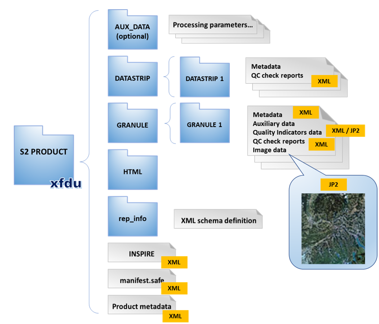
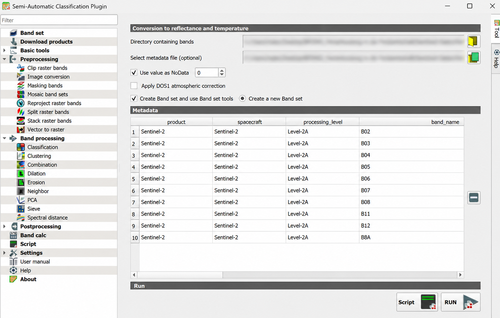
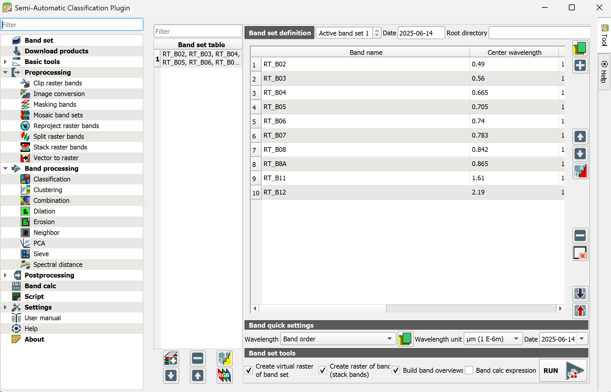
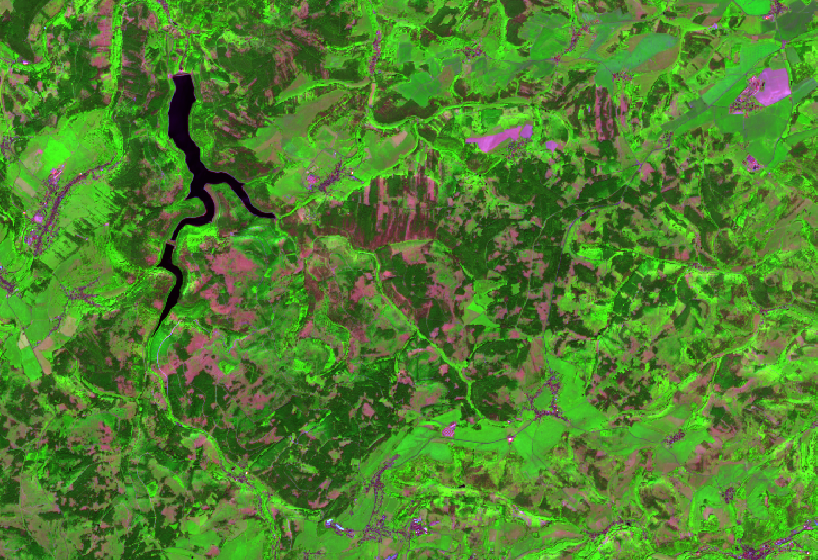

Satellitendaten bestehen zunächst aus einzelnen Banddateien mit digitalen Grauwerten (DN) und den zugehörigen Metadaten. Vor der Berechnung von Indizes -und insbesondere einer Zeitreihenanalyse- müssen diese digitalen Grauwerte der Bänder in ihre Reflektanzwerte überführt und als gemeinsamer Arbeitsdatensatz zusammengeführt werden. Die Vorprozessierung schafft daher eine vergleichbare und nachvollziehbare Ausgangsbasis für jegliche fernerkundungsbasierte Analysen.

## Bandspezifikationen

In den nächsten Einheiten wird mit folgenden Bändern gearbeitet:

| Band | Spektralbereich | Auflösung | Verwendung |
|---|---:|---:|---|
| B02 | Blau | 10 m | Echtfarben, Atmosphäre/Trübung |
| B03 | Grün | 10 m | Echtfarben, Wasser-/Vegetationskontraste |
| B04 | Rot | 10 m | Echtfarben, [NDVI](glossar.qmd#glossar-ndvi) |
| B05 | Red Edge 1 | 20 m | Vegetationszustand, Baumartenunterschiede |
| B06 | Red Edge 2 | 20 m | Vegetationsstruktur, Kronenunterschiede |
| B07 | Red Edge 3 | 20 m | Vegetationsvitalität, Klassifikation |
| B08 | Nahes Infrarot breit | 10 m | Vegetation, [NDVI](glossar.qmd#glossar-ndvi) |
| B8A | Nahes Infrarot schmal | 20 m | Vegetationszustand, Klassifikation |
| B11 | [SWIR](glossar.qmd#glossar-swir) 1 | 20 m | Feuchte, Trockenstress |
| B12 | [SWIR](glossar.qmd#glossar-swir) 2 | 20 m | trockene Oberflächen, Vegetationsunterschiede |

Die Bänder behalten bei der Vorprozessierung ihre native räumliche Auflösung von
10 beziehungsweise 20 m. Eine manuelle Angleichung oder ein Resampling ist in
dieser Einheit nicht vorgesehen. Das SCP-Plugin verwaltet die Bänder zunächst gemeinsam in
einem so genannten Band Set und erzeugt daraus die Inputlayer für die Geoverarbeitung.

## Vorprozessierung eines Satellitenbildes

### Bänder für SCP vorbereiten

Sentinel-2-L2A-Daten werden als SAFE-Ordnerstruktur bereitgestellt. Bilddaten
im Format `.jp2` und Metadaten im Format `.xml` liegen darin in verschiedenen
Unterordnern. Für die Vorprozessierung im SCP-Plugin werden die benötigten Bänder und die zugehörige Metadatendatei aus dieser Struktur in einen gemeinsamen Arbeitsordner kopiert.

{#fig-sentinel-safe-struktur fig-alt="Schematische Ordnerstruktur eines Sentinel-2-Produkts mit den Bereichen AUX_DATA, DATASTRIP, GRANULE, HTML und rep_info sowie Bilddaten im JP2-Format und Metadaten im XML-Format." width="85%"}

Nach der [SCP-FAQ](https://semiautomaticclassificationmanual.readthedocs.io/en/latest/faq.html#can-i-apply-the-conversion-to-sentinel-2-l2a-downloaded-from-the-web)
muss die Bandnummer den alleinigen Dateinamen bilden, zum Beispiel `B02.jp2`.

| Originaltyp | Zielname |
|---|---|
| `..._B02_10m.jp2` | `B02.jp2` |
| `..._B03_10m.jp2` | `B03.jp2` |
| `..._B04_10m.jp2` | `B04.jp2` |
| `...` | `BXX.jp2` |

1. Legen Sie den Ordner `01_rohdaten/sentinel2/2025-06-14_scp` an.
2. Kopieren Sie die benötigten `.jp2`-Bänder und die zugehörige
   Metadatendatei `MTD_MSIL2A` in diesen Ordner. Alle Dateien müssen auf derselben
   Ordnerebene liegen.
3. Benennen Sie die `.jp2`-Bänder nach dem Schema der Tabelle um.

### Vorprozessierung in SCP

Öffnen Sie QGIS und speichern Sie das Projekt als `einheit_3.qgz`.

Die Vorprozessierung erfolgt in SCP anhand der Sentinel-2-Metadaten. Bei einem
Level-2A-Produkt wendet **Image conversion** die hinterlegten Skalierungsfaktoren
an und überführt die gespeicherten Pixelwerte in Reflektanzwerte.

1. Öffnen Sie [SCP > Preprocessing > Image conversion]{.qgis-command}.
2. Wählen Sie unter **Directory containing bands** den vorbereiteten Ordner
   `01_rohdaten/sentinel2/2025-06-14_scp`.
3. Falls die Metadaten nicht automatisch erkannt werden, wählen Sie unter
   **Select metadata file (optional)** `MTD_MSIL2A` aus demselben
   Ordner.
4. Prüfen Sie in der Tabelle **Metadata**, ob **Sentinel-2**, **Level-2A** und
   die Bänder `B02`, `B03`, `B04`, `B05`, `B06`, `B07`, `B08`, `B8A`, `B11`
   und `B12` erkannt wurden.
5. Lassen Sie **Use value as NoData** mit dem Wert `0` aktiviert. Aktivieren Sie
   **Apply DOS1 atmospheric correction** nicht, da bereits ein
   Level-2A-Produkt verwendet wird.
6. Aktivieren Sie **Create Band set and use Band set tools** und wählen Sie
   **Create a new Band set**.
7. Klicken Sie auf **RUN** und speichern Sie die Ausgaben im Ordner
   `02_arbeitsdaten/sentinel2_20250614_preprocessed`.
8. Prüfen Sie, ob die erzeugten Reflektanzbänder mit dem Präfix `RT_` in QGIS
   geladen und einem neuen Band Set zugeordnet wurden.

{#fig-scp-preprocessing fig-alt="Geöffnetes SCP-Werkzeug Image conversion mit erkannten Sentinel-2-Metadaten; die persönlichen Dateipfade sind unkenntlich gemacht." width="100%"}

::: {.callout-tip title="Info"}
Die erzeugten `RT_`-Bänder behalten ihre räumliche Auflösung. Bänder mit 10 und
20 m Pixelgröße dürfen deshalb im Band Set gemeinsam vorkommen.
:::

### Band Set und Virtual Raster in SCP erstellen

Nach der Konvertierung enthält die Szene ein eigenes Band Set. Darin werden
Reihenfolge, Wellenlängen und Aufnahmedatum geprüft. 

1. Öffnen Sie [SCP > Band set]{.qgis-command}.
2. Wählen Sie in der **Band set table** das Band Set vom 14. Juni 2025 und
   setzen Sie es als **Active band set**.
3. Prüfen Sie in der **Band set definition** die Reihenfolge:
   `RT_B02`, `RT_B03`, `RT_B04`, `RT_B05`, `RT_B06`, `RT_B07`, `RT_B08`,
   `RT_B8A`, `RT_B11`, `RT_B12`.
4. Prüfen Sie die **Center wavelength**. Falls die Werte fehlen, wählen Sie
   unter **Band quick settings > Wavelength** die Vorlage **Sentinel-2**.
5. Tragen Sie unter **Date** das Aufnahmedatum der Szene ein.
6. Aktivieren Sie unter **Band set tools** die Optionen **Create virtual raster
   of band set** und **Create raster of band set (stack bands)**. Dadurch wird das Band Set lokal gespeichert. Aktivieren Sie
   zusätzlich **Build band overviews**.
7. Klicken Sie auf **RUN** und speichern Sie die Ausgaben im Ordner
   `02_arbeitsdaten`, zum Beispiel als `s2_20250614_bandset.vrt` und
   `s2_20250614_stack.tif`.

{#fig-scp-bandset fig-alt="SCP Band set definition mit zehn vorprozessierten Sentinel-2-Bändern, zugeordneten Zentralwellenlängen sowie aktivierten Optionen Create virtual raster of band set, Create raster of band set und Build band overviews." width="100%"}

::: {.callout-tip title="Info"}
Ein Virtual Raster (`.vrt`) ist zunächst nur eine Verknüpfung auf die einzelnen
Rasterdateien. Das spart Speicherplatz und ist für die Arbeit im Kurs meist
ausreichend. Der zusätzlich erzeugte Bandstack ist eine physische Rasterdatei
und kann unabhängig von den einzelnen Quelldateien weitergegeben werden.
:::

::: {.callout-tip title="Info"}
Mit dem SCP-Bandstack entsteht in QGIS eine neue, fortlaufende Bandreihenfolge. Die
ursprünglichen Sentinel-2-Nummern bleiben nicht erhalten, weil nicht benötigte
Bänder wie Aerosol, Wasserdampf und Cirrus fehlen. Ab diesem Punkt beziehen
sich Bandnummern in QGIS-Befehlen immer auf die Position im folgenden Stack:

| Sentinel-2-Band | QGIS-Stackband |
|---|---:|
| `B02` (Blau) | Band 1 |
| `B03` (Grün) | Band 2 |
| `B04` (Rot) | Band 3 |
| `B05` (Red Edge 1) | Band 4 |
| `B06` (Red Edge 2) | Band 5 |
| `B07` (Red Edge 3) | Band 6 |
| `B08` (NIR breit) | Band 7 |
| `B8A` (NIR schmal) | Band 8 |
| `B11` (SWIR 1) | Band 9 |
| `B12` (SWIR 2) | Band 10 |

Steht dagegen ausdrücklich `B02`, `B8A` oder `B12`, ist der ursprüngliche
Sentinel-2-Bandname gemeint.
:::

### Farbdarstellungen prüfen

1. Öffnen Sie mit Rechtsklick auf `s2_20250614_stack.tif`
   [Properties > Symbology]{.qgis-command}.
2. Erzeugen Sie eine Echtfarbenansicht mit **Red band = Band 3**,
   **Green band = Band 2** und **Blue band = Band 1**.
3. Erzeugen Sie eine Color-Infrared-Ansicht mit **Red band = Band 7**,
   **Green band = Band 3** und **Blue band = Band 2**.
4. Erzeugen Sie eine [SWIR](glossar.qmd#glossar-swir)-Ansicht mit
   **Red band = Band 10**, **Green band = Band 7** und
   **Blue band = Band 3**. Alternativ verwenden Sie Band 9 als roten Kanal.
5. Zoomen Sie auf Gösselsdorf und vergleichen Sie Wald, Offenland, Wege,
   Schatten und Siedlungsflächen.

{#fig-swir-saalfeld fig-alt="Falschfarbendarstellung des Raums Saalfeld am 14. Juni 2025 mit grüner Vegetation, magentafarbenen Offen- und Siedlungsflächen sowie dunklen Wasserflächen." width="100%"}

::: {.callout-note .checkpoint-callout title="Checkpoint"}
Welche Farbkombination sehen Sie hier? Können Sie Gösselsdorf auf dem
Satellitenbild finden?
:::

### Auf AOI zuschneiden

Das Zuschneiden erfolgt für alle vorprozessierten Einzelbänder im SCP. Als
Eingabe dient das Band Set mit den `RT_`-Bändern, als räumliche Begrenzung der
Vektorlayer `AOI-buffer`.

1. Öffnen Sie [SCP > Preprocessing > Clip raster bands]{.qgis-command}.
2. Wählen Sie unter **Select input band set** das Band Set mit den zehn
   `RT_`-Bändern vom 14. Juni 2025.
3. Aktivieren Sie **Use vector for clipping** und wählen Sie `AOI-buffer` als
   Vektorlayer.
4. Tragen Sie unter **Output name** das Präfix `clip_` ein.
5. Klicken Sie auf **RUN** und wählen Sie `02_arbeitsdaten` als Ausgabeordner.
6. Prüfen Sie, ob SCP zehn zugeschnittene Einzelbänder mit Namen wie
   `clip_RT_B02.tif` bis `clip_RT_B12.tif` erzeugt und in QGIS geladen hat.
7. Öffnen Sie [SCP > Band set]{.qgis-command} und erstellen Sie ein neues Band
   Set.
8. Aktualisieren Sie die Layerliste und fügen Sie alle `clip_`-Bänder in der
   ursprünglichen Sentinel-2-Reihenfolge hinzu.
9. Wählen Sie unter **Band quick settings > Wavelength** den Eintrag
   **Sentinel-2**, tragen Sie das Aufnahmedatum `2025-06-14` ein und aktivieren
   Sie das neue Band Set.
10. Aktivieren Sie unter **Band set tools** die Option **Create virtual raster
    of band set**, klicken Sie auf **RUN** und speichern Sie die Ausgabe als
    `s2_20250614_aoi.vrt`.
11. Visualisieren Sie das Virtual Raster mit einer der Farbkombinationen aus
    Abschnitt 3.2.4 und prüfen Sie, ob der Ausschnitt vollständig durch
    `AOI-buffer` begrenzt ist.
