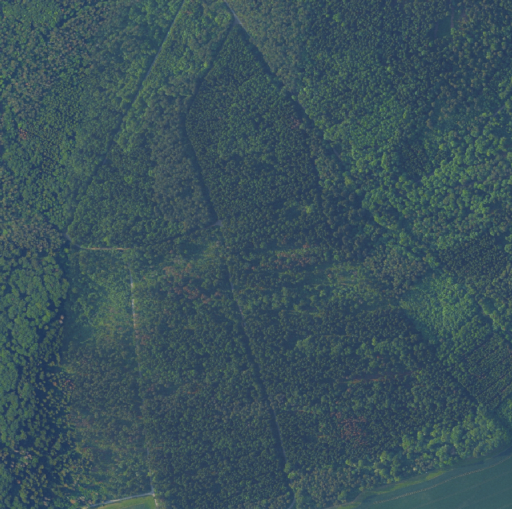
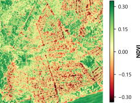

::: {.callout-tip .practice-callout title="Praxisauftrag"}
Im Meininger Stadtwald gibt es vermehrt Hinweise auf abgestorbene Einzelbäume und
Kalamitätsflächen. Für eine flächige Suche im Wald fehlt jedoch die
Zeit. Filtern Sie bereits im Vorfeld die Verdachtsflächen heraus, in denen
geschädigte oder abgestorbene Baumkronen zu erwarten sind. Das
Revierteam soll anschließend gezielt diese Stellen anlaufen.
:::

## Untersuchungsraum

Für diese Übung wird der Normalized Difference Vegetation Index (NDVI)
testweise in einem 1km² Ausschnitt angewendet. Geeignet sind Waldränder,
Wege, Offenland und geschlossene Bestände, weil dort die Unterschiede im
Indexbild gut sichtbar werden.

## Digitale Orthophotos recherchieren

Öffnen Sie QGIS und speichern Sie das Projekt als `einheit_4.qgz`.

Digitale Orthophotos für Thüringen werden über das Geoportal Thüringen
und das Thüringer Landesamt für Bodenmanagement und Geoinformation
bereitgestellt.

Ein [Web Map Service (WMS)](glossar.qmd#glossar-wms) stellt
georeferenzierte Kartenbilder über das Internet bereit, ohne dass die
zugrunde liegenden Rasterdateien lokal gespeichert werden müssen.

Wichtige Links:

- [Download Luftbilder und Orthophotos im Geoportal
  Thüringen](https://geoportal.thueringen.de/gdi-th/download-offene-geodaten/download-luftbilder-und-orthophotos)
- [Informationen zu DOP und DOP-WMS im Geoportal
  Thüringen](https://geoportal.geoportal-th.de/gaialight-th/_apps/dladownload/dl-lbop-info.html)

Für diese Übung sind vor allem DOP20 relevant. Es handelt sich dabei
um ein Digitales Orthophoto mit 20 cm Bodenauflösung und im Idealfall mit NIR-Kanal. Diese werden jährlich landesweit für den Freistaat Thüringen erstellt. Nutzen Sie zunächst den WMS zur Orientierung und laden Sie für die Berechnung nur
jene DOP-Kacheln herunter, die den gewählten Ausschnitt abdecken.

## Thüringer DOP20 nutzen

::: {.callout-warning title="Quellenvermerk"}
Beachten Sie die angezeigten Nutzungsbedingungen und verwenden Sie bei
einer Veröffentlichung den Quellenvermerk `© GDI-Th`.
:::

:::: panel-tabset
### WMS in QGIS

#### Schritt für Schritt in QGIS {.unnumbered}

1.  Öffnen Sie QGIS und das Projekt `einheit_4.qgz`.

2.  Öffnen Sie [View \> Panels \> Browser]{.qgis-command}, falls das
    Browser-Panel nicht sichtbar ist.

3.  Klicken Sie mit der rechten Maustaste auf **WMS/WMTS**.

4.  Wählen Sie **New Connection...**.

5.  Tragen Sie als Name `GDI-Th DOP20` ein.

6.  Tragen Sie als URL ein:

    ``` text
    https://www.geoproxy.geoportal-th.de/geoproxy/services/DOP20
    ```

7.  Klicken Sie auf **OK**.

8.  Klicken Sie auf **Connect**.

9.  Öffnen Sie die neue **Connection** `GDI-Th DOP20`.

10. Fügen Sie den Layer `th_dop` hinzu. Das ist das DOP20 in Farbe/RGB.

11. Fügen Sie zusätzlich `th_dop20cir` hinzu. Das ist das
    Color-Infrared-Orthophoto.

{#fig-qgis-wms-dop20-layer
fig-alt="QGIS Data Source Manager mit einer verbundenen DOP20-WMS-Quelle und den auswählbaren Layern DOP Infrarot, DOP Grau, DOP Farbe und DOP Metainformationen."
width="100%"}

::: {.callout-note .checkpoint-callout title="Checkpoint"}
Fügen Sie aus dem WMS den Layer `th_dop_info` hinzu. Wählen Sie
**Attributes Toolbar \> Identify Features** und klicken Sie in eine
beliebige Kachel. Wann fand die Befliegung statt?
:::

### DOP-Kacheln herunterladen

Für die NDVI-Berechnung wird ein lokales DOP20 benötigt.

1.  Öffnen Sie den [Downloadbereich für Luftbilder und
    Orthophotos](https://geoportal.thueringen.de/gdi-th/download-offene-geodaten/download-luftbilder-und-orthophotos).
2.  Wählen Sie den Dataset-Eintrag **DOP20**.
3.  Suchen Sie oben nach Meiningen.
4.  Filtern Sie nach Luftbildern bis zum Jahr 2024.
4.  Wählen Sie ein Gebiet im Stadtwald und laden Sie eine Kachel herunter. Achten Sie auf das rgbi-Kürzel, welches aussagt, dass es sich um ein multispektrales DOP mit RGB und NIR-Kanal handelt.
5.  Speichern Sie die Datei unter `01_rohdaten/DOP`.

{#fig-geoportal-dop20
fig-alt="Downloadbereich des Geoportals Thüringen mit der Ortssuche nach Meiningen, verfügbaren Befliegungsdaten und einer ausgewählten DOP20-Kachel."
width="100%"}
::::

## NDVI berechnen

1.  Ziehen Sie die GeoTIFF-Datei in QGIS in das **Layers Panel**.
2.  Öffnen Sie [Raster \> Raster Calculator...]{.qgis-command}.
3.  Tragen Sie die NDVI-Formel mit den passenden Bandnummern ein.Die allgemeine Formel lautet:

``` text
NDVI = (NIR - Red) / (NIR + Red)
```
4.  Speichern Sie die Ausgabe als `NDVI.tif`.
5.  Legen Sie die Datei im Ordner `03_ergebnisse/indizes` ab.
6.  Laden Sie `NDVI.tif` in QGIS, falls es nicht automatisch
    erscheint.

## Ergebnis darstellen

1.  Öffnen Sie mit Rechtsklick auf `NDVI.tif` [Properties \>
    Symbology]{.qgis-command}.
2.  Wählen Sie **Singleband pseudocolor**.
3.  Nutzen Sie einen Grün-Rot-Farbverlauf von niedrigen zu hohen
    NDVI-Werten.
4.  Prüfen Sie typische Bereiche: geschlossener Wald, Waldrand, Wiese,
    Wege, Boden, Schatten.
5.  Vergleichen Sie den NDVI mit dem RGB-DOP.

::: {#fig-ndvi-meiningen-vergleich layout-ncol=2}
{.ndvi-comparison-image fig-alt="Digitales Orthophoto eines Waldgebiets im Stadtwald Meiningen mit geschlossenen Beständen, Wegen und einzelnen auffälligen Baumkronen."}

{.ndvi-comparison-image fig-alt="NDVI"}

Gegenüberstellung des DOP20 und des daraus berechneten NDVI im Stadtwald Meiningen.
:::

::: {.callout-note .checkpoint-callout title="Checkpoint"}
Der südliche Bereich zeigt niedrige NDVI-Werte, liegt aber am Waldrand. Würden
Sie dort auf geringe Vitalität schließen?
:::
