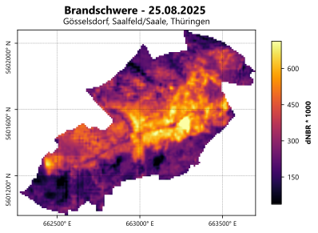
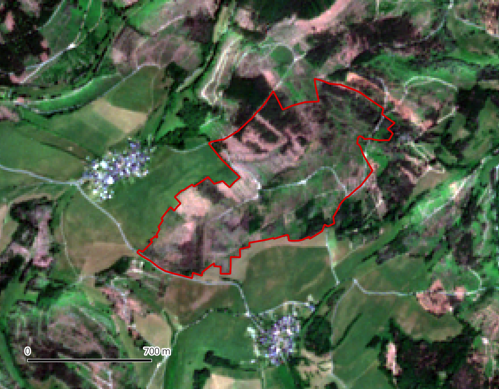
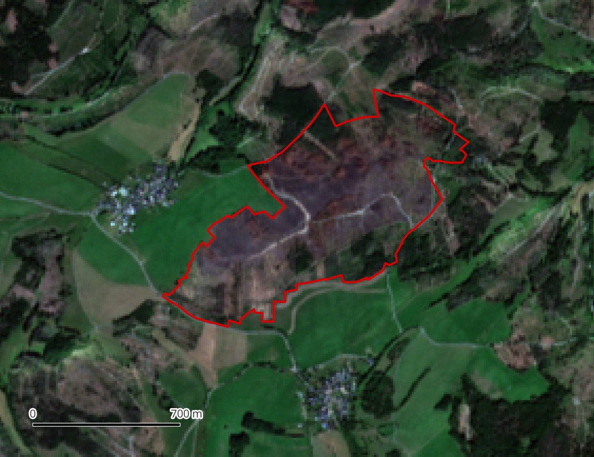

{#fig-dnbr-rasterdarstellung fig-alt="Kartendarstellung des dNBR-Rasters im Untersuchungsraum mit einer Farbskala von dunklen niedrigen bis hellen hohen Werten." width="75%"}

::: {.callout-tip .practice-callout title="Praxisauftrag"}
Nach dem Waldbrand bei Gösselsdorf braucht die Forstamtsleitung ein kompaktes Lagebild: Welche Hinweise gibt es zur Brandursache? Welche Bereiche sind besonders betroffen und wo sollten Wege und Restbestände zuerst kontrolliert werden?
:::

## Untersuchungsraum

Die Fallstudie bezieht sich auf den Waldbrand bei Gösselsdorf auf der
Saalfelder Höhe. Laut amtlichen Informationen wurde der Alarm am
2. Juli 2025 um 14:24 Uhr ausgelöst. Wegen trockener Vegetation und starken
Windes breitete sich das Feuer schnell auf etwa 250 ha aus. Der Landkreis
stellte am selben Tag um 17:30 Uhr den Katastrophenfall fest. Am 7. Juli 2025
war das Feuer unter Kontrolle, am 14. Juli 2025 wurde "Feuer aus" gemeldet.

## Sentinel-2-Szene nach dem Brand herunterladen

::: {#fig-sentinel2-zeitvergleich layout-ncol=2}
{fig-alt="Sentinel-2-Aufnahme des Untersuchungsraums bei Gösselsdorf vom 14. Juni 2025 mit rot umrandeter Untersuchungsfläche."}

{fig-alt="Sentinel-2-Aufnahme des Untersuchungsraums bei Gösselsdorf vom 25. August 2025 mit rot umrandeter Untersuchungsfläche."}

Sentinel-2-Aufnahmen des Untersuchungsraums vor und nach dem Waldbrand.
:::

Um das Ausmaß des Brandes kartieren zu können, benötigen Sie eine möglichst wolkenarme Satellitenbildaufnahme nach dem Ereignis. Wiederholen Sie die Recherche und den Download aus 
[Einheit 2](02-recherche-download-satellitenbild.qmd#sentinel-2-daten-beschaffen).
Wählen Sie diesmal den Zeitraum `2025-08-15` bis `2025-08-31` und laden Sie die Szene vom **25. August 2025** herunter. Wiederholen Sie entsprechend auch den Ablauf aus [Vorprozessierung eines Satellitenbildes](03-vorverarbeitung.qmd#vorprozessierung-eines-satellitenbildes)
für die neue Szene.

::: {.callout-note title="Info"}
Beide Raster müssen denselben räumlichen Ausschnitt und dasselbe
Koordinatenbezugssystem besitzen. Verwenden Sie deshalb für beide Zeitpunkte
dieselbe `aoi_saalfelder_hoehe` und dieselben Einstellungen beim Zuschneiden.
:::

## Datenbasis

Für NBR und dNBR sind folgende Bänder relevant:

| Band | Bereich | Funktion |
|---|---|---|
| `B08` oder `B8A` | Nahes Infrarot | vitale Vegetation, Kronenstruktur |
| `B12` | SWIR 2 | Trockenheit, Brandspuren, gestörte Vegetation |

Die Bezeichnungen in dieser Tabelle sind die ursprünglichen Sentinel-2-Bandnamen.
In QGIS werden für Befehle die Positionen im vorbereiteten SCP-Bandstack verwendet; die
vollständige Zuordnung steht im Abschnitt
[Band Set und Virtual Raster in SCP erstellen](03-vorverarbeitung.qmd#band-set-und-virtual-raster-in-scp-erstellen).

::: {.callout-tip title="Info"}
Für Sentinel-2 wird der NBR oft mit `B8A` und `B12` berechnet, weil `B8A` als
schmaleres NIR-Band gut zu klassischen NBR-Anwendungen passt. `B8A` und `B12`
liegen beide mit 20 m Auflösung vor.
:::


## NBR berechnen

Die Formel lautet:

```text
NBR = (NIR - SWIR2) / (NIR + SWIR2)
```

1. Öffnen Sie [Raster > Raster Calculator...]{.qgis-command}.
2. Berechnen Sie zuerst den NBR für die Szene vom 14. Juni 2025.
3. Wenn Ihr SCP-Bandstack in der Reihenfolge aus der Vorverarbeitung aufgebaut ist,
   entspricht `B8A` dem Band 8 und `B12` dem Band 10. Der Ausdruck lautet dann:

   ```text
   ("s2_20250614_aoi@8" - "s2_20250614_aoi@10") /
   ("s2_20250614_aoi@8" + "s2_20250614_aoi@10")
   ```

4. Speichern Sie die Ausgabe als `nbr_20250614.tif` im Ordner
   `03_ergebnisse/indizes`.
5. Wiederholen Sie die Berechnung für die Szene vom 25. August 2025:

   ```text
   ("s2_20250825_aoi@8" - "s2_20250825_aoi@10") /
   ("s2_20250825_aoi@8" + "s2_20250825_aoi@10")
   ```

6. Speichern Sie die Ausgabe als `nbr_20250825.tif`.

Wenn Sie für den NBR `B08` statt `B8A` verwenden, nutzen Sie in der
vorbereiteten SCP-Stackreihenfolge Band 7 statt Band 8:

```text
("s2_20250614_aoi@7" - "s2_20250614_aoi@10") /
("s2_20250614_aoi@7" + "s2_20250614_aoi@10")
```

## dNBR berechnen

Die Formel lautet:

```text
dNBR = NBR_vorher - NBR_nachher
```

1. Laden Sie `nbr_20250614.tif` und `nbr_20250825.tif` in QGIS.
2. Öffnen Sie [Raster > Raster Calculator...]{.qgis-command}.
3. Berechnen Sie:
   `"nbr_20250614@1" - "nbr_20250825@1"`.
4. Speichern Sie das Ergebnis als `dnbr_2025.tif`.
5. Symbolisieren Sie `dnbr_2025.tif` mit einem Farbverlauf von geringer zu
   starker Veränderung.
   
## dNBR-Schädigungskarte als Orientierung

Für eine erste Einordnung kann `dnbr_2025.tif` nach den häufig verwendeten
dNBR-Klassen von USGS und US Forest Service dargestellt werden:

| dNBR | Orientierungsklasse |
|---:|---|
| `-0.50` bis `< -0.25` | starke Zunahme der Vegetationsantwort |
| `-0.25` bis `< -0.10` | geringe Zunahme der Vegetationsantwort |
| `-0.10` bis `< 0.10` | unverändert bis sehr geringe Schädigung |
| `0.10` bis `< 0.27` | geringe Schädigung |
| `0.27` bis `< 0.44` | geringe bis moderate Schädigung |
| `0.44` bis `< 0.66` | moderate bis hohe Schädigung |
| `≥ 0.66` | hohe Schädigung |

::: {.callout-warning title="Lokale Validierung erforderlich"}
Der dNBR misst lediglich spektrale Veränderungen. Er belegt weder Baumsterblichkeit noch unmittelbare Bodenschädigung. Prüfen Sie die Klassen deshalb stets mit Orthophotos und falls möglich mit Geländebeobachtungen. Passen Sie Grenzwerte gegebenenfalls unter Zuhilfenahme der Werteverteilung im Histogram an.
:::

1. Öffnen Sie mit Rechtsklick auf `dnbr_2025.tif`
   [Properties > Symbology]{.qgis-command}.
2. Wählen Sie **Render type = Singleband pseudocolor** und
   **Interpolation = Discrete**.
3. Legen Sie die Klassengrenzen aus der Tabelle manuell an.
4. Verwenden Sie für negative Veränderungen Grüntöne, für unveränderte Bereiche
   ein neutrales Grau und für zunehmende Schädigung eine Abfolge von Gelb über
   Orange bis Rot bzw. Schwarz.

::: {.callout-note .checkpoint-callout title="Checkpoint"}
Finden Sie im dNBR-Ergebnis Hinweise auf den Brandursprung?
:::

