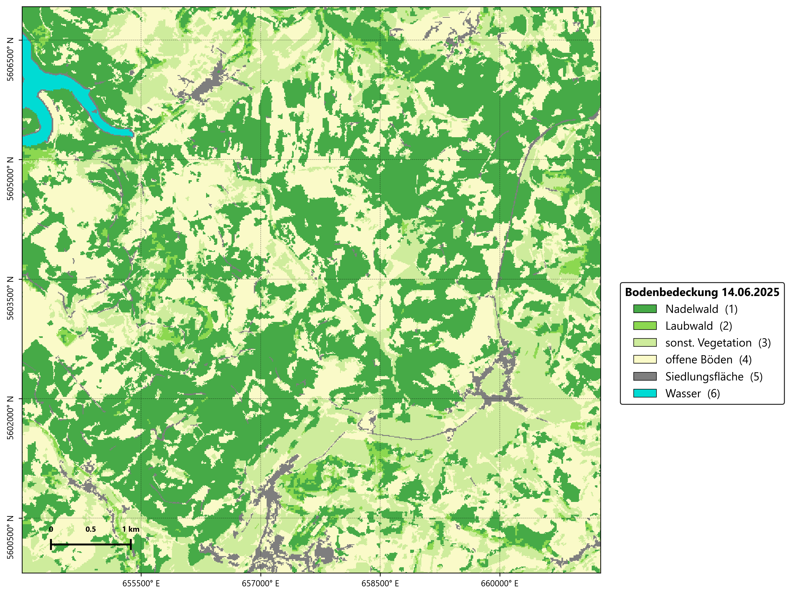{#fig-klassifikationsergebnis-karte width=88% fig-align="center" style="border: 0; box-shadow: none;"}

::: {.callout-tip .practice-callout title="Praxisauftrag"}
Für die Vorbereitung einer Inventur soll eine Übersichtskarte erstellt werden,
die Nadelwald und Laubwald von den wichtigsten Offenland- und
Siedlungsflächen trennt. Das Revierteam möchte zunächst erkennen, wo
größere zusammenhängende Bestände liegen.
:::

## Random Forest

Die überwachte Klassifikation ist das Herzstück der Fernerkundung. Hierzu gibt es verschiedene Algorithmen, die aus den Pixeln von Referenzflächen lernen und eine kategorische karte erzeugen. Der Random Forest Algorithmus kombiniert im Gegensatz zum einfach Decision-Tree-Verfahren viele Entscheidungsbäume. Jeder Baum stimmt anhand unterschiedlicher Informationen über die Klasse eines Pixels ab. Am Ende entscheidet die
Mehrheit über das Ergebnis.


## Datenbasis und Band Set

Nutzen Sie das Band Set der Sentinel-2-Szene vom 14. Juni 2025 aus der
Vorverarbeitung (Band Set 1 mit Prefix RT_clip): 

1. Öffnen Sie QGIS und speichern Sie das Projekt als `einheit_6.qgz`.
2. Öffnen Sie [SCP > Band set]{.qgis-command}.
3. Aktivieren Sie das Band Set vom 14. Juni 2025.
4. Prüfen Sie Reihenfolge und Vollständigkeit der zehn vorprozessierten Bänder.
5. Wählen Sie unter **Band quick settings > Wavelength** den Eintrag
   **Sentinel-2**. Kontrollieren Sie anschließend die Wellenlängen.
6. Stellen Sie in der **Working toolbar** unter **RGB=** zunächst `3-2-1` ein.
   Diese Kombination zeigt mit der Bandreihenfolge des Kurses ein
   Echtfarbenbild.
7. Legen Sie zusätzlich den DOP-WMS als Interpretationshilfe
   unter die Sentinel-2-Daten.

## Klassenschema für Baumarten und Bestandestypen

SCP organisiert Trainingsflächen auf zwei Ebenen:

| Eintrag | Bedeutung |
|---|---|
| **MC ID** | Nummer der Macroclass und damit der späteren Kartenklasse, zum Beispiel `1` für Nadelwald |
| **MC Name** | lesbarer Name der Macroclass, zum Beispiel `Nadelwald` |
| **C ID** | Nummer einer einzelnen spektralen Variante innerhalb der Macroclass |
| **C Name** | kurze Beschreibung dieser Variante, zum Beispiel `Fichte Nordhang` oder `Fichte Sonnenlage` |

Mehrere Trainingsflächen können unterschiedliche **C IDs** besitzen, aber über
dieselbe **MC ID** zu einer gemeinsamen Kartenklasse gehören. Beispielsweise
können `Fichte Nordhang` und `Fichte Sonnenlage` spektral etwas verschieden sein,
werden über **MC ID 1** jedoch beide als `Nadelwald` ausgegeben.

| MC ID | Klasse | Beispiel | Hinweise für Trainingsflächen |
|---:|---|:---:|---|
| 1 | Nadelwald | 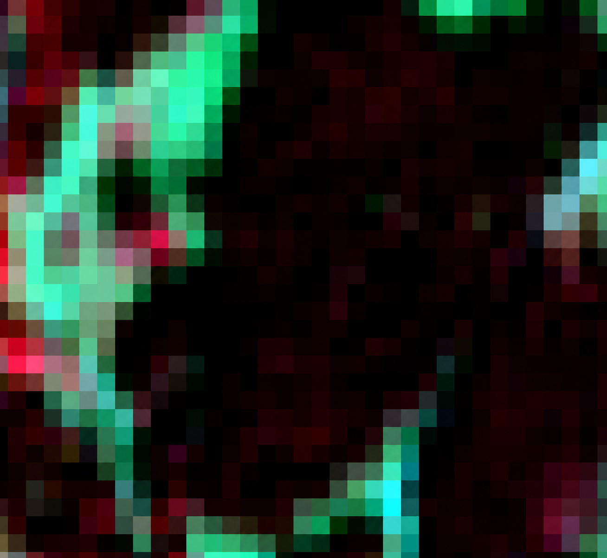{width=64px} | dunkler NIR-/CIR-Eindruck, geschlossene Bestände, möglichst homogene Flächen |
| 2 | Laubwald | 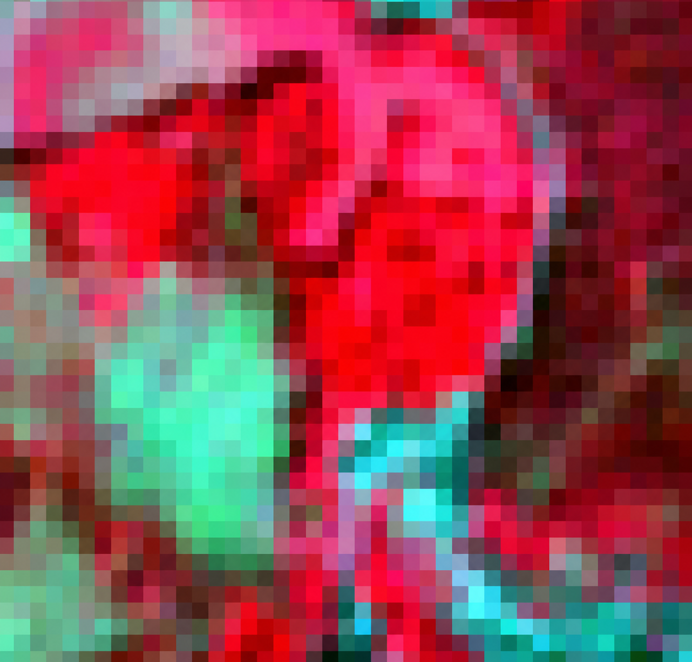{width=64px} | stärkere saisonale Dynamik, häufig hellere Vegetationssignatur |
| 3 | sonstige Vegetation | 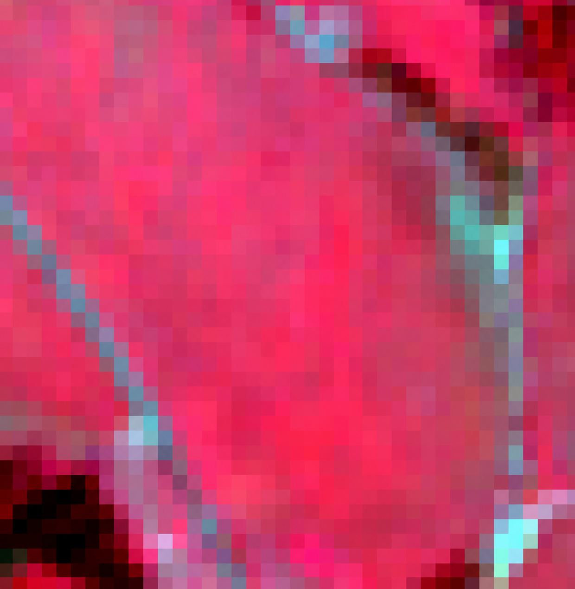{width=64px} | Wiesen, Weiden, krautige Vegetation außerhalb geschlossener Wälder |
| 4 | Offene Böden | 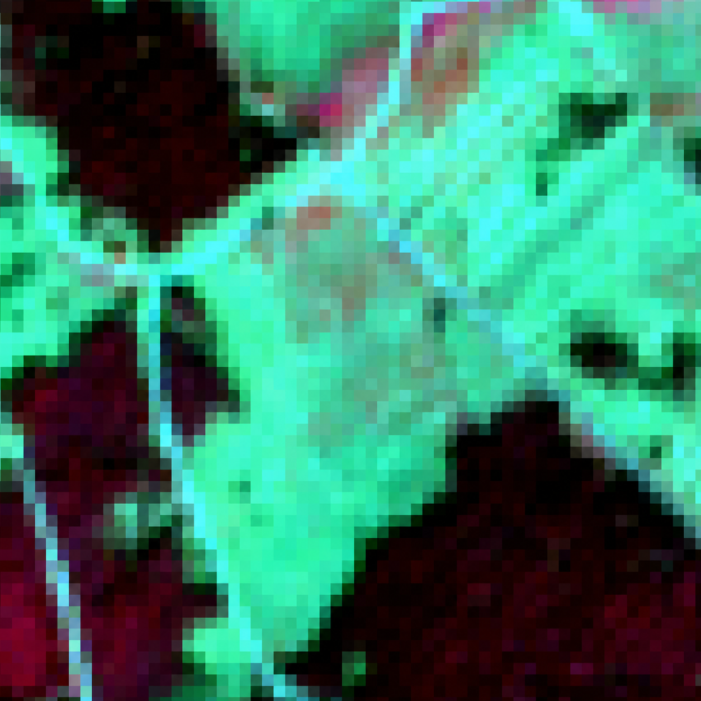{width=64px} | unbewachsene oder frisch bearbeitete Flächen, saisonal stark unterschiedlich |
| 5 | Siedlungsfläche | 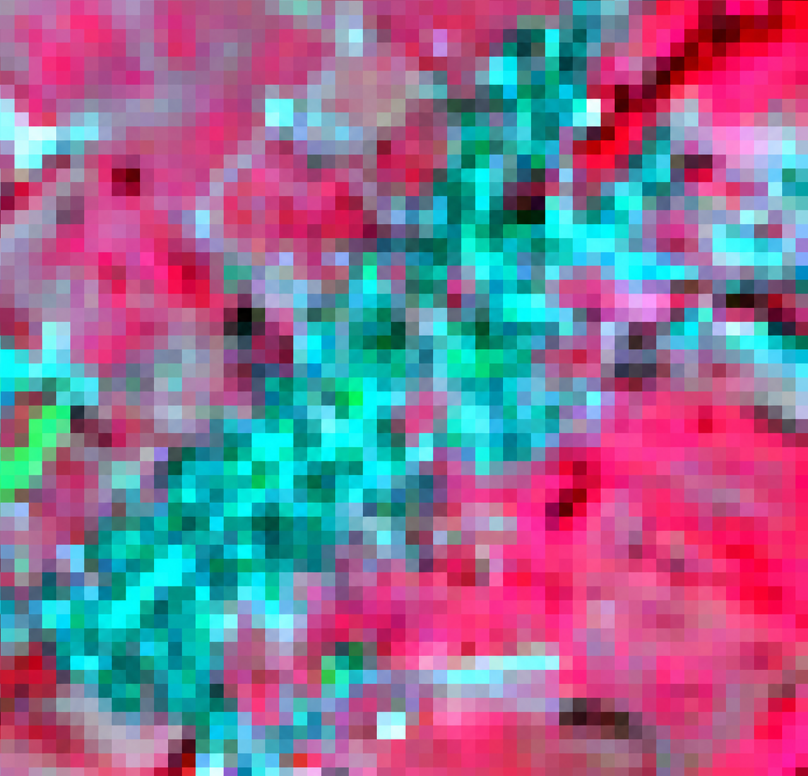{width=64px} | Dächer, Straßen und andere befestigte Flächen |
| 6 | Wasser | 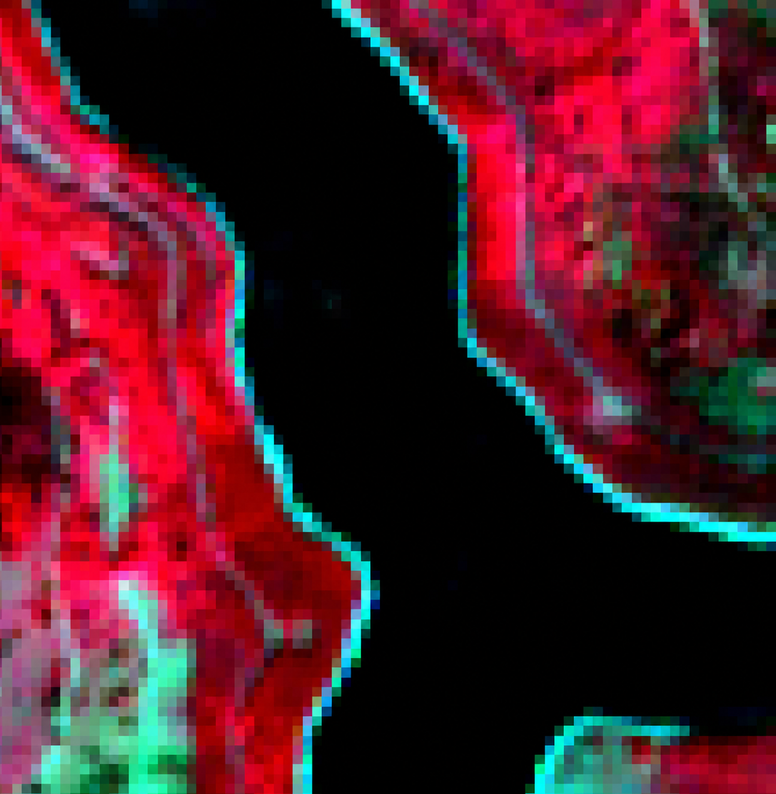{width=64px} | sehr dunkle Pixel, Schatten nicht mit Wasser verwechseln |

## Trainingsflächen erstellen

### Training input anlegen

1. Öffnen Sie den Tab **Training input** im **SCP Dock**.
2. Klicken Sie oben auf auf **Create new training input**.
3. Speichern Sie die Datei als
   `02_arbeitsdaten/ROI-06142025.scpx`. Es entsteht ein neuer Training layer im Layerpanel. Jeder Training Input bezieht sich auf ein bestimmtes Band Set. In unserem Fall Band Set 1.
4. Aktivieren Sie **Autosave**, falls die Option angezeigt wird, und speichern
   Sie zusätzlich regelmäßig das QGIS-Projekt.
5. Bearbeiten Sie den Training input ausschließlich mit den SCP-Werkzeugen.

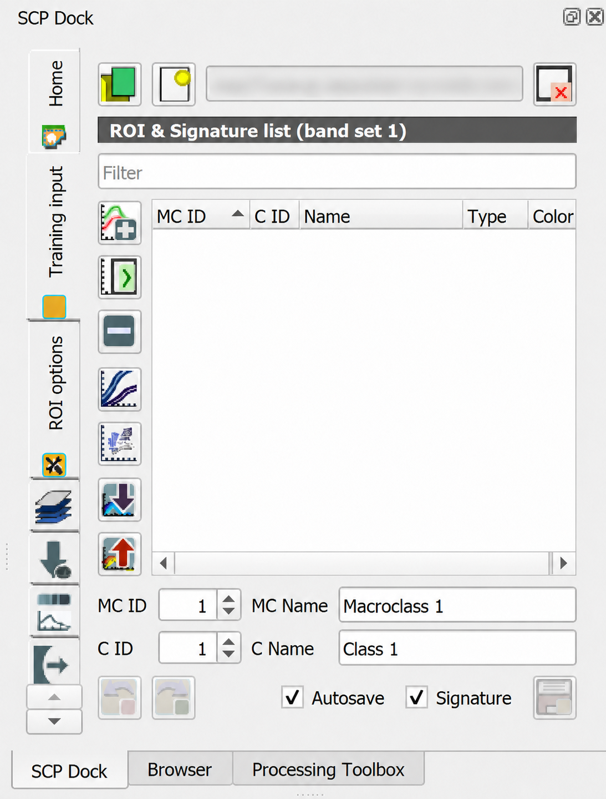{#fig-scp-training-input width=48% fig-align="center"}

### ROIs erfassen

1. Zoomen Sie auf eine möglichst eindeutige Referenzfläche.
2. Legen Sie im **SCP Dock** **MC ID** und **MC Name** entsprechend dem
   Klassenschema fest.
3. Vergeben Sie für jede neue Trainingsfläche eine eigene **C ID** und einen
   kurzen **C Name**.
4. Aktivieren Sie in der **Working toolbar** das Werkzeug zum manuellen Zeichnen
   einer ROI.
5. Zeichnen Sie ein Polygon innerhalb einer möglichst homogenen Fläche. Schließen
   Sie das Polygon mit einem Rechtsklick.
6. Speichern Sie die ROI im Training input.
7. Erfassen Sie je Klasse mindestens fünf räumlich getrennte ROIs.
8. Verteilen Sie die ROIs über unterschiedliche Bestände und Bildbereiche.
9. Meiden Sie Waldränder, Wege, Schatten, Einzelbäume und deutlich gemischte
   Pixel.

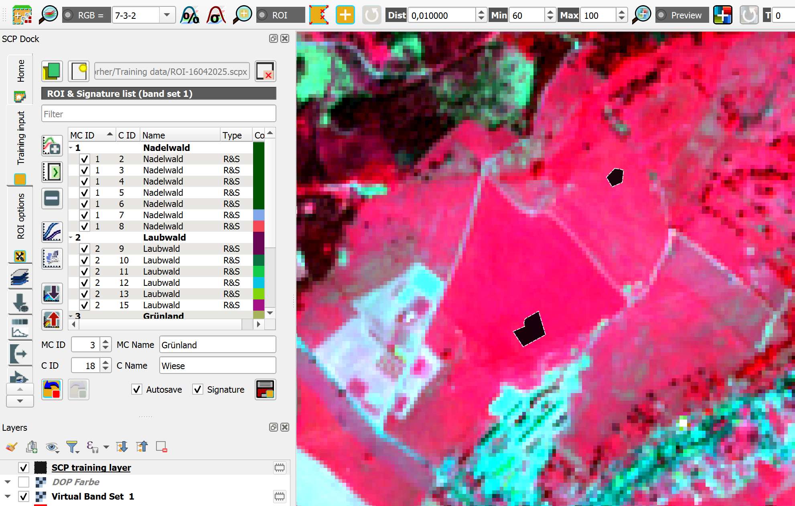{#fig-scp-classification-trainingsamples width=100%}

::: {.callout-note .checkpoint-callout title="Checkpoint"}
Eine Trainingsfläche sieht im Orthophoto eindeutig aus, liegt in Sentinel-2 aber
an einem Bestandesrand. Würden Sie sie verwenden?
:::

### ROIs und Klassenfarben prüfen

1. Öffnen Sie im **SCP Dock** die **ROI & Signature list**.
2. Prüfen Sie, ob alle ROIs der richtigen **MC ID** zugeordnet sind.
3. Vergeben Sie für jede Macroclass eine gut unterscheidbare Farbe. Diese Farben
   werden später für die Klassifikation verwendet.
4. Doppelklicken Sie auf einzelne ROIs, um deren Lage erneut zu prüfen.
5. Öffnen Sie bei Bedarf den **Spectral Signature Plot** und vergleichen Sie die
   Klassen. Überarbeiten Sie ROIs, die deutlich außerhalb ihrer Klasse liegen.
6. Ergänzen Sie Klassen, die nur wenige oder räumlich einseitige Beispiele
   enthalten.

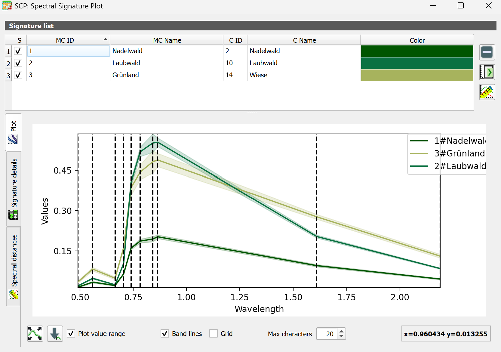{#fig-scp-signature-plot width=100%}

::: {.callout-note .checkpoint-callout title="Checkpoint"}
Sonstige Vegetation und Laubwald liegen in mehreren Bändern eng beieinander. Würden mehr
Trainingsflächen helfen?
:::

## Klassifikationsvorschau erstellen

### Random Forest einstellen

::: {.callout-note title="Info"}
Für den Random-Forest-Klassifikator benötigt SCP das Python-Paket **scikit-learn**. Schließen Sie QGIS, öffnen Sie unter Windows über das Startmenü die **OSGeo4W Shell** und führen Sie diesen Befehl aus:

```bash
python -m pip install scikit-learn
```

Starten Sie QGIS danach neu. Die Installation ist nur einmal erforderlich.
:::

1. Öffnen Sie [SCP > Band processing > Classification]{.qgis-command}.
2. Wählen Sie unter **Select input band set** das Band Set vom 14. Juni 2025.
3. Aktivieren Sie **Use training Macroclass ID**. Dadurch entsprechen die
   Ausgabewerte den MC IDs des Klassenschemas.
4. Wählen Sie unter **Algorithm** den Eintrag **Random Forest**.
5. Tragen Sie zunächst `100` bei **Number of trees** ein.
6. Belassen Sie **Minimum number to split** auf `2`.
7. Lassen Sie alle anderen Einstellungen unverändert.

### Vorschau vergleichen

1. Stellen Sie in der **Working toolbar** unter **Classification preview** die
   **Size** auf `200`.
2. Aktivieren Sie **Classification preview** und klicken Sie in einen typischen
   Ausschnitt des Untersuchungsraums.
3. Prüfen Sie die Vorschau anhand von Sentinel- und dem DOP20.
4. Erstellen Sie weitere Vorschauen in Wald, Offenland und Siedlungsflächen.
5. Ergänzen oder korrigieren Sie ROIs, wenn eine Klasse wiederholt unplausibel
   erscheint.

::: {.callout-note .checkpoint-callout title="Checkpoint"}
Die Vorschau mit 100 Bäumen sieht fast genauso aus wie die mit 10 Bäumen.
Spricht das bereits für ein gutes Modell?
:::

## Klassifikation berechnen

1. Öffnen Sie erneut [SCP > Band processing > Classification]{.qgis-command}.
2. Prüfen Sie Band Set, Training input und **Use training Macroclass ID**.
3. Wählen Sie **Random Forest** und übernehmen Sie die in @fig-rf-classification-start
   gezeigten Einstellungen.

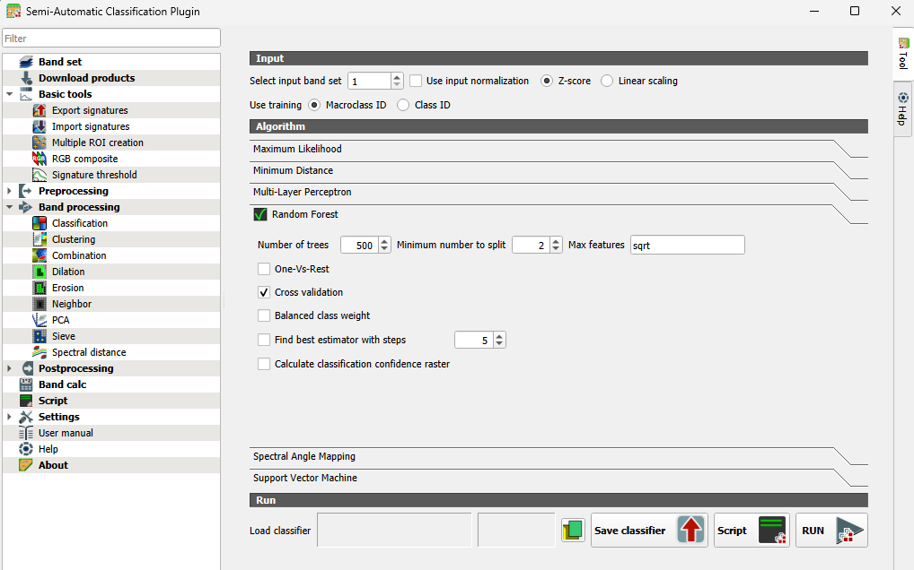{#fig-rf-classification-start width=100%}

4. Klicken Sie auf **RUN**.
5. Speichern Sie die Klassifikation als
   `03_ergebnisse/rf_baumarten_saalfelder_hoehe.tif`.
6. Speichern Sie den trainierten Klassifikator über **Save classifier** unter
   `02_arbeitsdaten/rf_baumarten_saalfelder_hoehe.rsmo`.
7. Warten Sie, bis die Klassifikation in QGIS geladen wurde.

## Ergebnis nachbearbeiten

Klassifikationen enthalten häufig einzelne, verstreute Pixel. Dieser
**Salt-and-Pepper-Effekt** lässt sich mit **Sieve** reduzieren. Das Werkzeug
ersetzt sehr kleine Pixelgruppen durch die Klasse der größten angrenzenden
Fläche.

1. Öffnen Sie [SCP > Band set]{.qgis-command}.
2. Erstellen Sie ein neues Band Set und fügen Sie
   das Klassifikationsergebnis als einziges Band hinzu.
3. Öffnen Sie [SCP > Band processing > Sieve]{.qgis-command}.
4. Wählen Sie unter **Select input band set** das neue Band Set mit der
   Klassifikation.
5. Tragen Sie bei **Size threshold** den Wert `2` ein. Damit werden zunächst nur
   isolierte Einzelpixel ersetzt.
6. Wählen Sie bei **Pixel connection** den Wert `8`. Diagonal benachbarte Pixel
   gelten damit als zusammenhängend.
7. Tragen Sie als **Output name** `sieve_` ein und lassen Sie **Virtual output**
   deaktiviert.
8. Klicken Sie auf **RUN** und speichern Sie das Ergebnis als
   `03_ergebnisse/rf_baumarten_saalfelder_hoehe_sieve.tif`.
9. Erhöhen Sie den Schwellenwert nur vorsichtig, wenn noch viele isolierte Pixel
    verbleiben. Mit zunehmendem Wert können auch reale kleine Flächen verloren
    gehen.

10. Öffnen Sie [SCP > Band set]{.qgis-command} und erstellen Sie ein neues Band
    Set.
11. Aktualisieren Sie die Layerliste und fügen Sie nur
    `rf_baumarten_saalfelder_hoehe_sieve.tif` hinzu.
12. Aktivieren Sie dieses Band Set. Der nachbearbeitete Sieve-Output ist nun das
    erste und einzige Band.

## Klassifikationsreport erstellen

Der Klassifikationsreport liefert direkte Hinweise auf die Flächenanteile im Untersuchungsraum. Gerade für Veränderungsanalysen ist er ein geeignetes Mittel zur Flächenbilanzierung.

1. Öffnen Sie [SCP > Postprocessing > Classification report]{.qgis-command}.
2. Wählen Sie unter **Select the classification** die Datei
   `sieve_RF-vorher.tif`.
3. Aktivieren Sie **Use value as NoData** und tragen Sie `0` ein, falls `0` in
   Ihrer Klassifikation den Hintergrund bezeichnet.
4. Klicken Sie auf **RUN** und speichern Sie die .csv-Datei ab.
5. Prüfen Sie im SCP-Tab **Output** für jede Klasse Pixelzahl, Fläche und Anteil.


## Ergebnisse darstellen

Zum Abschluss kann aus der nachbearbeiteten Klassifikation eine Karte in QGIS
erstellt werden. Der Klassifikationsreport liefert außerdem die Flächenanteile
der einzelnen Bodenbedeckungsklassen. Diese Werte lassen sich beispielsweise in
Excel oder R als Diagramm darstellen.

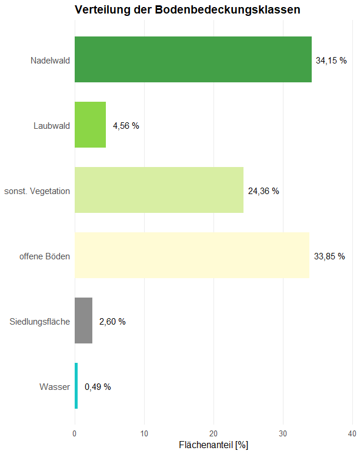{#fig-klassenanteile width=46% fig-align="center"}
