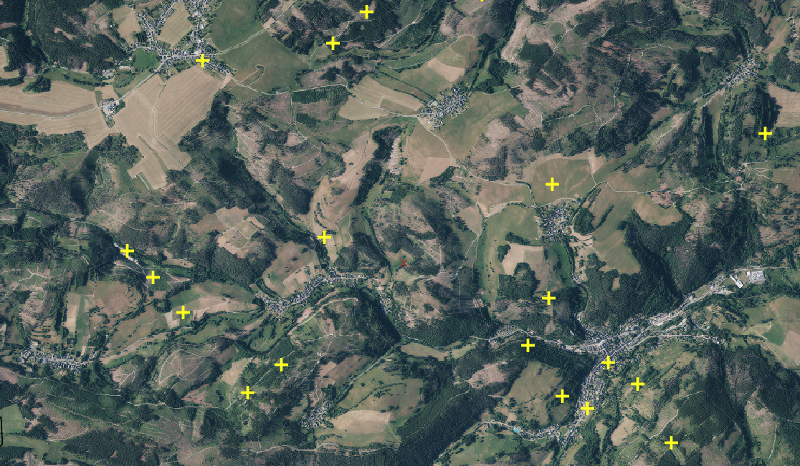
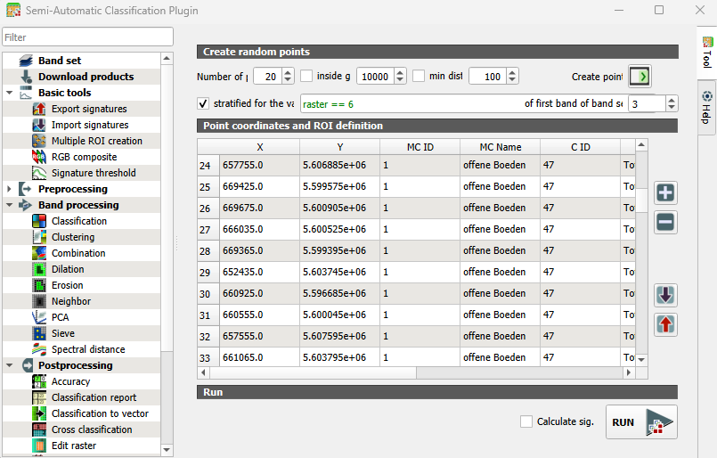
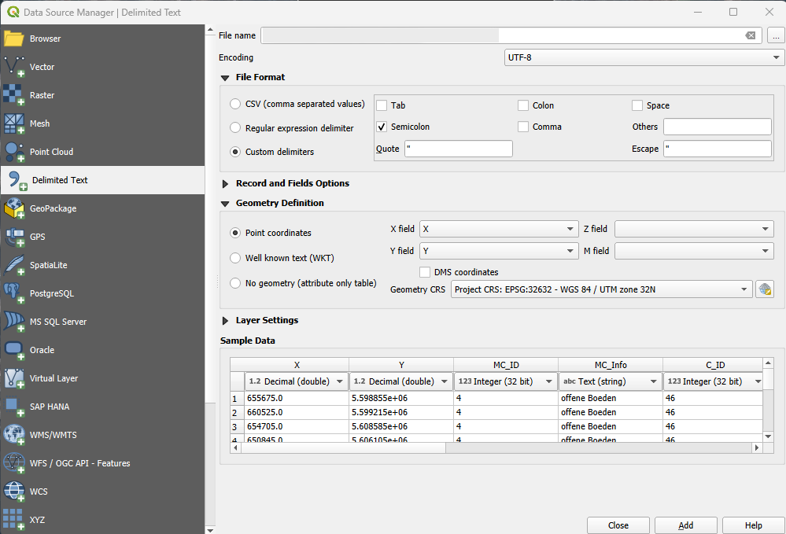
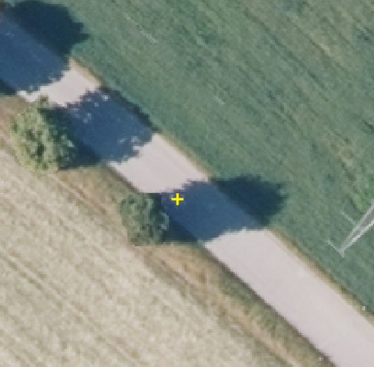
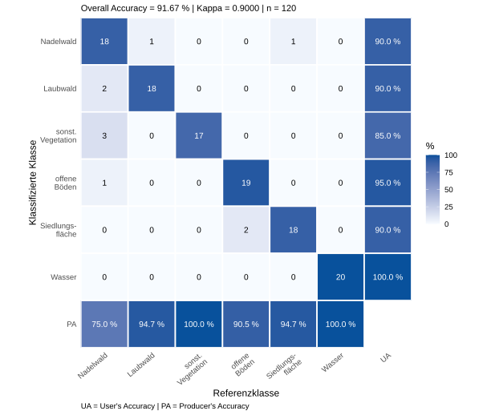

{#fig-referenzpunkte-verteilung width=100%}

::: {.callout-tip .practice-callout title="Praxisauftrag"}
Bevor die Karte in eine Präsentation, eine Projektmappe oder eine Besprechung im
Forstamt wandert, braucht sie einen Realitätscheck. Die entscheidende Frage ist
nicht, ob die Karte hübsch aussieht, sondern welche Aussagen man ihr zumuten
kann: Welche Klassen halten dem Blick ins Orthophoto stand, wo kippt die
Interpretation, und was müsste draußen im Bestand nachgeprüft werden?
:::

## Stichprobe erzeugen

Beim [Accuracy Assessment](glossar.qmd#glossar-accuracy-assessment) wird die
Klassifikation aus Einheit 6 mit unabhängigen Referenzflächen verglichen. Die
Prüfflächen dürfen deshalb nicht aus den Trainingsdaten übernommen werden. In
SCP werden zunächst zufällige, nach Kartenklassen geschichtete Punkte erzeugt.
In QGIS werden daraus 10 × 10 m große Pixelpolygone, die anschließend anhand
eines Orthophotos oder anderer unabhängiger Informationen interpretiert werden.

Öffnen Sie das QGIS-Projekt aus Einheit 6 und speichern Sie es als
`einheit_7.qgz`. Laden Sie die finale Klassifikation
`03_ergebnisse/rf_baumarten_saalfelder_hoehe_sieve.tif` sowie DOP20-WMS und die
Sentinel-2-Szene vom 14. Juni 2025.

### Klassifikation als Band Set aktivieren

1. Öffnen Sie [SCP > Band set]{.qgis-command}.
2. Aktivieren Sie das in Einheit 6 angelegte Band Set mit
   `rf_baumarten_saalfelder_hoehe_sieve.tif`.

### Geschichtete Zufallspunkte erstellen

1. Öffnen Sie [SCP > Basic tools > Multiple ROI Creation]{.qgis-command}.
2. Tragen Sie unter **Number of points** den Wert `20` ein.
3. Aktivieren Sie **stratified for the values**.
4. Wählen Sie das Band Set, dessen erstes Band das Klassifikationsraster enthält.
5. Geben Sie für Nadelwald den Ausdruck `raster == 1` ein und klicken Sie auf
   **Create points**.
6. Wiederholen Sie den Vorgang nacheinander mit `raster == 2`, `raster == 3`,
   `raster == 4`, `raster == 5` und `raster == 6`. Am Ende müssen 6 Klassen × 20 Punkte, also insgesamt 120 Punkte,
   vorliegen.

{#fig-export-points width=88% fig-align="center"}

### Punktliste exportieren

1. Klicken Sie rechts neben der Tabelle auf den roten Pfeil **Export the point list to text
   file**.
2. Speichern Sie die Datei als `02_arbeitsdaten/ground-truth-points.csv`.

### Punktdatei in QGIS laden

1. Öffnen Sie [Layer > Add Layer > Add Delimited Text Layer…]{.qgis-command}.
2. Wählen Sie `ground-truth-points.csv` und stellen Sie **Delimiter** auf **Tab**.
3. Wählen Sie unter **Geometry definition** die Option **Point coordinates**.
4. Legen Sie `X` als **X field** und `Y` als **Y field** fest.
5. Wählen Sie das Koordinatenreferenzsystem des Klassifikationsrasters.
6. Fügen Sie die Datei hinzu und kontrollieren Sie, ob die Punkte korrekt über
   der Klassifikation liegen.
7. Klicken Sie mit der rechten Maustaste auf den Punktlayer und wählen Sie
   [Export > Save Features As…]{.qgis-command}.
8. Speichern Sie ihn permanent im Format **GeoPackage** als
   `02_arbeitsdaten/ground-truth.gpkg`.

{#fig-punktdatei-laden width=100%}

### Punkte in Pixelpolygone umwandeln

1. Öffnen Sie [Processing > Toolbox]{.qgis-command} und suchen Sie nach
   **Rectangles, ovals, diamonds** unter **Vector geometry**.
2. Wählen Sie `ground-truth` als **Input layer**.
3. Stellen Sie **Shape** auf **Rectangle**, **Width** und **Height** jeweils auf
   `10` sowie **Rotation** auf `0`.
4. Speichern Sie das Ergebnis als
   `02_arbeitsdaten/ground-truth_polygons.gpkg`.

Jedes Polygon repräsentiert damit genau ein 10 × 10 m großes Rasterpixel.

## Referenzklassen bestimmen

1. Öffnen Sie die Attributtabelle von `ground-truth_polygons` und starten Sie den
   Bearbeitungsmodus.
2. Erstellen Sie ein neues Integer-Feld mit dem Namen `ref_class`.
3. Blenden Sie die Klassifikation aus. Die Referenzklasse wird unabhängig von der vorhergesagten Klasse der
Klassifikation bestimmt.
4. Bestimmen Sie für jedes Polygon die tatsächliche Klasse anhand des DOP-WMS
   und gegebenenfalls Ihrer Ortskenntnis.
5. Tragen Sie in `ref_class` die passende Klassen-ID ein:

   `1` = Nadelwald  
   `2` = Laubwald  
   `3` = sonstige Vegetation  
   `4` = offene Böden  
   `5` = Siedlungsfläche  
   `6` = Wasser

6. Wiederholen Sie die Interpretation für alle 120 Polygone und speichern Sie
   die Änderungen.

::: {.callout-note .checkpoint-callout title="Checkpoint"}
{width=32% fig-align="center"}

*Orthophoto: © GDI-Th*

Die Straße ist 5 m breit. Welche Bodenbedeckungsklasse würden Sie für diesen Referenzpunkt
in der Attributtabelle eintragen?
:::

## Accuracy Assessment ausführen

1. Blenden Sie die Klassifikation wieder ein.
2. Öffnen Sie [SCP > Postprocessing > Accuracy]{.qgis-command}.
3. Wählen Sie unter **Select the classification to assess** die Datei
   `rf_baumarten_saalfelder_hoehe_sieve.tif`.
4. Wählen Sie unter **Select the reference vector or raster** den Vektorlayer
   `ground-truth_polygons.gpkg`.
5. Wählen Sie unter **Vector field** das Feld `ref_class`.
6. Aktivieren Sie **Use value as NoData** mit dem Wert `0`, falls `0` nur den
   Hintergrund bezeichnet.
7. Klicken Sie auf **RUN** und speichern Sie die Ausgabe als
   `03_ergebnisse/validierung/accuracy_rf.tif`.

SCP lädt das Fehlerraster in QGIS und erzeugt daneben eine gleichnamige
tabulatorgetrennte CSV-Datei. Im Fehlerraster steht jeder Wert für eine
bestimmte Kombination aus Karten- und Referenzklasse. Die Zuordnung ist in der
Spalte `ErrorMatrixCode` der Ausgabedatei dokumentiert.

## Ergebnisse einordnen

Verwenden Sie für diese Übung die ungegewichtete **ERROR MATRIX
[Pixel count]**. In der SCP-Matrix stehen die Zeilen für die
Klassifikation und die Spalten für die Referenz.

- **Gesamtgenauigkeit:** Summe der Diagonale geteilt durch die Gesamtzahl der
  Stichproben.
- **Nutzergenauigkeit:** Diagonalwert geteilt durch die jeweilige Zeilensumme.
- **Produzentengenauigkeit:** Diagonalwert geteilt durch die jeweilige
  Spaltensumme.
- **Kappa:** ergänzende Übereinstimmungskennzahl, die nicht allein über die
  Verwendbarkeit der Karte entscheidet.

Prüfen Sie zuerst die Genauigkeiten der einzelnen Klassen und danach die
Gesamtgenauigkeit. Eine hohe Gesamtgenauigkeit kann eine schwache, aber für die
Fragestellung wichtige Klasse verdecken.

::: {.callout-note .checkpoint-callout title="Checkpoint"}
Würden Sie der Klassifikation vertrauen? Ordnen Sie die Genauigkeitsmaße ein.
:::

{#fig-fehlermatrix width=732px fig-align="center"}
