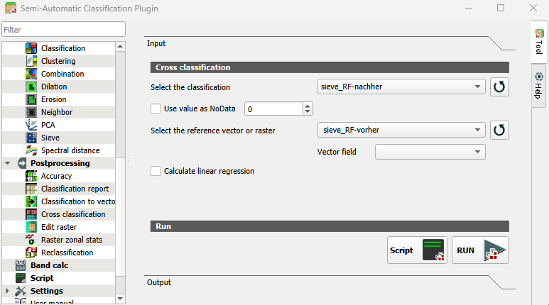
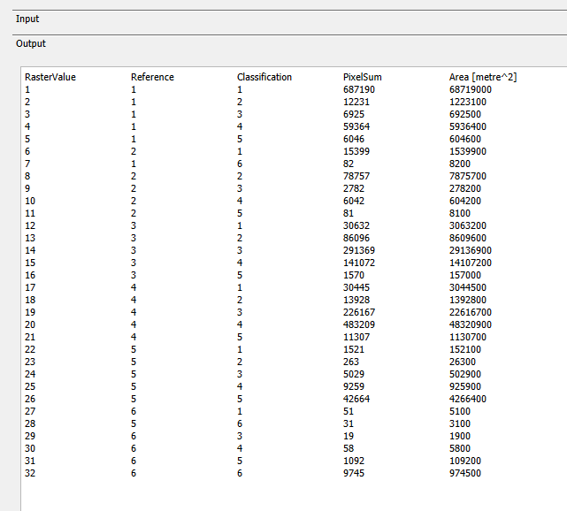
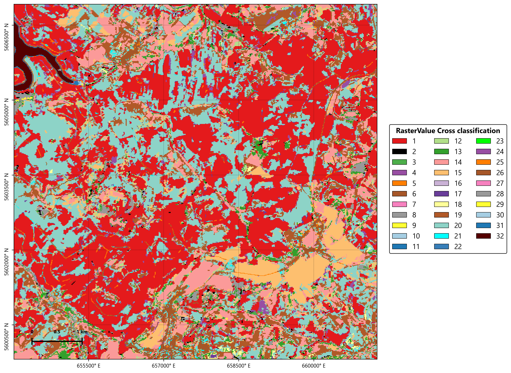

::: {.callout-tip .practice-callout title="Praxisauftrag"}
Der Revierleitung liegen zwei Karten aus unterschiedlichen Jahren vor. Nun soll
erkennbar werden, wo Waldklassen stabil geblieben sind und wo ehemals bewaldete
Flächen heute einer anderen Klasse zugeordnet werden.
:::

## Zwei Klassifikationen vergleichen

In dieser Einheit werden zwei Klassifikationen von 2025 (Referenz) und 2026
verglichen. Beide Karten verwenden dasselbe Klassenschema wie in Einheit 6.

Öffnen Sie QGIS und speichern Sie das Projekt als `einheit_8.qgz`. Laden Sie:

- `rf_baumarten_saalfelder_hoehe.tif` als Klassifikation von 2025,
- `rf_baumarten_saalfelder_hoehe_aktuell.tif` als aktuelle Klassifikation.

## Cross classification ausführen und Matrix öffnen

1. Öffnen Sie [SCP > Postprocessing > Cross classification]{.qgis-command}.
2. Wählen Sie unter **Select the classification** die aktuelle Klassifikation.
3. Aktivieren Sie **Use value as NoData** mit `0`, falls `0` den Hintergrund
   bezeichnet.
4. Wählen Sie unter **Select the reference vector or raster** die Klassifikation
   von 2025.
5. Lassen Sie **Vector field** leer, da die Referenz ebenfalls ein Raster ist.
6. Deaktivieren Sie **Calculate linear regression**. Die Klassenwerte sind
   Kategorien und keine kontinuierlichen Messwerte.
7. Klicken Sie auf **RUN** und speichern Sie die Ausgabe als
   `03_ergebnisse/veraenderung/cross_2025_aktuell.tif`.
8. Warten Sie, bis SCP das Cross-Raster in QGIS geladen hat.
9. Öffnen Sie im SCP-Fenster den Tab **Output**. Dort wird die berechnete
   Veränderungsmatrix unmittelbar nach dem Lauf angezeigt.
10. Öffnen Sie zusätzlich im Ausgabeordner die Datei
    `cross_2025_aktuell.csv`. Sie trägt denselben Namen wie das Cross-Raster und
    enthält die Matrix als tabulatorgetrennte Tabelle.

{#fig-cross-classification width=86% fig-align="center"}

Die Veränderungsmatrix erscheint nicht als eigener Layer im **Layers Panel**.
Sie steht im SCP-Tab **Output** und in der CSV-Datei. Das Cross-Raster ist eine
zweite, räumliche Ausgabe: Jeder Rasterwert steht für genau eine Kombination
aus alter und aktueller Klasse. Die Verbindung zwischen Tabelle und Raster
wird über `RasterValue` hergestellt.

## Cross-Raster darstellen und interpretieren

::: {.columns}
::: {.column width="34%"}
**Rohwerte**

{width=100% fig-alt="Rohwerte der Cross classification aus SCP mit Referenzklasse, klassifizierter Klasse, Pixelanzahl und Fläche"}
:::

::: {.column width="66%"}
**Cross-Raster**

{width=100% fig-alt="Cross-Raster mit den Rasterwerten der Klassenkombinationen"}
:::
:::

Die obigen beiden Darstellungen zeigen dasselbe Ergebnis. Jede Zeile der SCP-Ausgabe
beschreibt eine Kombination aus **Reference** und **Classification**. Der
zugehörige `RasterValue` kennzeichnet diese Kombination mit einer Zahl zwischen 1 und 32 im Cross-Raster. Die
Farben sind willkürlich gewählt und dienen zunächst nur dazu, die Rasterwerte räumlich voneinander zu
unterscheiden.

1. Öffnen Sie mit Rechtsklick auf `cross_2025_aktuell.tif`
   [Properties > Symbology]{.qgis-command}.
2. Wählen Sie **Paletted/Unique values** und klicken Sie auf **Classify**.
3. Lesen Sie zu jedem Rasterwert den passenden `RasterValue` aus der
   CSV-Datei ab.
4. Beschriften Sie wichtige Übergänge nach dem Muster
   `Nadelwald > sonstige Vegetation`.
5. Stellen Sie unveränderte Kombinationen neutral oder transparent dar.
6. Verwenden Sie auffällige Farben nur für jene Übergänge, die im Gelände
   geprüft werden sollen.
7. Vergleichen Sie die Übergangsflächen mit beiden Ausgangsklassifikationen und
   einem Orthophoto.

## Veränderungsmatrix 

In der Einstellung aus Abschnitt 8.4 ist die Klassifikation von 2025 die
**Reference** und damit der Ausgangszustand. Die aktuelle Klassifikation steht
unter **Classification** und ist der Zielzustand. In
@fig-veraenderungsmatrix steht deshalb die Referenzklasse von 2025 auf der
y-Achse und die aktuell klassifizierte Klasse auf der x-Achse.

Die in Abschnitt 8.5 gezeigten Rohwerte enthalten mit `PixelSum` die Anzahl der
Pixel und mit `Area [metre^2]` die zugehörige Fläche. Zur besseren Übersicht
wurden die Werte für @fig-veraenderungsmatrix zeilenweise in Prozent
umgerechnet und grafisch dargestellt.

{#fig-veraenderungsmatrix width=100% fig-align="center"}

Lesen Sie jede Zelle **von der Zeile zur Spalte**: `89,0 %` in der Zeile
Nadelwald und der Spalte Nadelwald sind unverändert. `14,9 %` in der Zeile
Laubwald und der Spalte Nadelwald wurden 2025 als Laubwald referenziert und
aktuell als Nadelwald klassifiziert. `25,6 %` in der Zeile sonstige Vegetation
und der Spalte offene Böden beschreiben entsprechend diesen Klassenwechsel. Die
Prozentwerte beziehen sich jeweils auf die Referenzklasse einer Zeile.

- Gleiche Klassenwerte in beiden Jahren bilden die Diagonale der Matrix. Diese
  Flächen gelten als unverändert.
- Werte außerhalb der Diagonale beschreiben einen Klassenwechsel.

Für die forstliche Betrachtung sind unter anderem folgende Übergänge
interessant:

| Von 2025 | Zu aktuell | Erste Einordnung |
|---|---|---|
| Nadelwald | sonstige Vegetation | möglicher Verlust geschlossener Waldfläche |
| Laubwald | sonstige Vegetation | möglicher Verlust geschlossener Waldfläche |
| sonstige Vegetation | Nadelwald | mögliche Entwicklung oder Aufforstung |
| sonstige Vegetation | Laubwald | mögliche Entwicklung oder Aufforstung |
| Nadelwald | Laubwald | Bestandesänderung oder Klassifikationsunterschied |
| Laubwald | Nadelwald | Bestandesänderung oder Klassifikationsunterschied |

::: {.callout-note .checkpoint-callout title="Checkpoint"}
Eine größere Fläche wechselt innerhalb kurzer Zeit von Nadelwald zu Laubwald.
Welche Erklärung fällt Ihnen dazu ein?
:::

