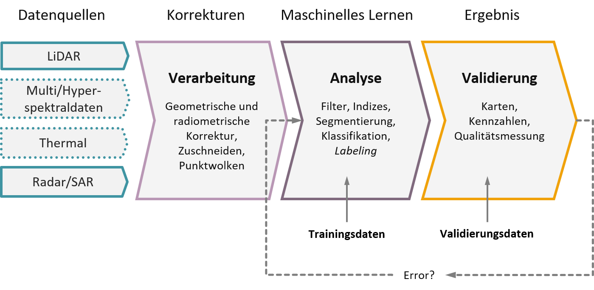

# Willkommen {-}

Dieses Kursbuch ist Teil des freien Wahlmoduls **Fernerkundung in der
Forstwirtschaft** im BSc Studiengang Forstwirtschaft an der Fachhochschule Erfurt.

## Aufbau {.unnumbered}

Das Buch ist als begleitendes Medium zur Grundlagenvorlesung und der Nachbereitung der Übungen am PC gedacht. Der Aufbau orientiert sich am klassischen Ablauf eines Fernerkundungsverfahrens (s. Abbildung 1). Ein Großteil der Übungen widmet sich einer spezifischen Fragestellung aus dem Forstalltag. Dabei stehen sowohl Auswertungen von digitalen Luft- und Satellitenbildern als auch 3D-Daten im Mittelpunkt. Zum Ende der letzten Einheit sollten Sie die erlernten Inhalte auf eigene forstliche Fragestellungen übertragen können.

{#fig-fernerkundungsprozess fig-alt="Schematischer Ablauf eines Fernerkundungsverfahrens von den Datenquellen über Verarbeitung und Analyse bis zur Validierung" width="100%"}

::: {.ai-disclaimer}
Hinweis zum Einsatz generativer KI: Bei der Erstellung dieses Quartobooks
verwendete der Autor OpenAI Codex, um die technische Umsetzung in Quarto zu
unterstützen. Der Autor hat die Inhalte anschließend geprüft und bei Bedarf
bearbeitet und übernimmt die volle Verantwortung für die veröffentlichten
Inhalte.
:::

